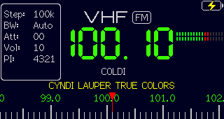

# User Manual

```{note}
This manual covers the **XE1E fork**. The **Menu** and **Settings menu** sections match the
firmware exactly. The **Main screen** section below describes this fork's reworked Default layout,
which differs from the stock screenshot (S-meter moved to the right, no MHz/kHz unit label, RDS
RadioText scrolling on the middle line, etc.). See `ROADMAP.md` for planned/possible features.
```

## Main screen



* **S-meter / RSSI meter** (top right, to the right of the frequency). Shows the full 17-segment scale: lit bars for the current signal strength and dim bars for the rest, so it keeps a constant width. In FM mode it also serves as a mono/stereo indicator (split into two rows).
* **Settings save icon** (top center). The settings are saved to non-volatile memory after 10 seconds of inactivity.
* **Bluetooth icon** (next to the save icon). Different colors indicate the connection status.
* **Wi-Fi icon** (top right area near the battery). Different colors indicate the connection status.
* **Battery status** (top right corner). It doesn't show the voltage when charged, see [#36](https://github.com/esp32-si4732/ats-mini/issues/36#issuecomment-2778356143). The only indication that the battery is charging is the hardware LED on the bottom of the receiver, which turns ON during charging.
* **Band name and modulation** (VHF & FM, top center). See the [Bands table](#bands-table) for more details.
* **Info panel** (the box on the left side), also the **Menu**. It shows the current value of each menu parameter (Step, Bandwidth, AGC/ATTN, Volume, AVC, and the RDS PI code when available). All of them are explained in the [Menu](#menu) section.
* **Frequency** (center of the screen). The MHz/kHz unit label is intentionally omitted in this layout to leave room on the right for the signal/tuning indicator.
* **FM station name** (RDS PS) or **frequency name** (small font, right below the frequency). A frequency name appears for some popular frequencies like FT8, SSTV, CB channels, or a shortwave [schedule](#schedule). Can also display the current **menu option** using a bigger font when the Zoom Menu setting is enabled.
* **RDS RadioText** (scrolling). When extended RDS is enabled (`ALL-CT` or `ALL`), the RadioText (RT) scrolls horizontally in **yellow** across the middle line, full width, below the frequency. See the **RDS** option in the [Settings menu](#settings-menu).
* **Tuning scale** (bottom of the screen). Its tuning pointer is automatically shortened while RDS text is shown, so it doesn't collide with the scrolling text. In Scan mode the area shows RSSI/SNR graphs instead.

## Alternative UI


The differences are:

* **Stereo indicator** is on the right side of the band and mode (VHF & FM).
* **Tuning scale** (right under the station name). Numbers on the left & right sides are the band limits.
* **S/N Meter** (in dB). The range is 0...127 and the visual indicator linearly displays this range.
* **RSSI & S-Meter** (the number is in dBµV, the meter is in S-points). Please note that the RSSI range is also 0...127 (no negative values) and according to [these tables](https://dl4zao.de/_downloads/Dezibel.pdf) any values below S4 on HF (rssi < 4) and below S7 on VHF (rssi < 2) are bogus. Thus it is very far from being precise, and also depends on the antenna impedance.

Both meters can be replaced with additional RDS fields (RT, PTY) when extended RDS is enabled, or RSSI/SNR graphs in Scan mode.

## Controls

Controls are implemented through the encoder knob:

| Gesture                | Result                                                                |
|------------------------|-----------------------------------------------------------------------|
| Rotate                 | Tunes frequency, navigates menu, adjusts parameters.                  |
| Click (<0.5 sec)       | Opens menu, selects.                                                  |
| Short press (>0.5 sec) | Volume shortcut in VFO mode, context-dependent action in other modes. |
| Long press (>2 sec)    | Sleep on/off.                                                         |
| Press and rotate       | Direct frequency input mode, fine tuning in Seek mode.                |

### Direct frequency input mode

* Press and rotate the encoder to select the step (digit or "half-digit").
* Rotate the encoder to adjust the frequency.
* Use short press to align frequency to the current step.
* To exit the mode, click the encoder or wait for a couple of seconds.

## Menu

The menu can be invoked by clicking the encoder button and is closed automatically after a couple of seconds.

* **Mode** - **FM** (only on the VHF band); **LSB, USB, AM** (on other bands). FM cannot be selected on non-VHF bands. No NFM mode on any band (SI4732 limitation).
* **Band** - List of [Bands](#bands-table).
* **Volume** - **0** (silent) ... **63** (max), default **35**. Headphone volume can be low vs the speaker (hardware limitation). Short press to mute/unmute.
* **Step** - Tuning step, per mode (not all apply to every band):
  * **FM:** 10k · 50k · **100k** (default) · 200k · 1M
  * **AM:** 1k · **5k** (default) · 9k · 10k · 50k · 100k · 1M
  * **SSB:** 10 · 25 · 50 · 100 · 500 Hz · **1k** (default) · 5k · 9k · 10k
* **Seek** - Seek up/down on AM/FM, normal tuning on LSB/USB (no hardware seek on SSB). Rotate/click to stop. Short press toggles between **Seek** and **Schedule** ([EiBi](#schedule)) modes. Press-and-rotate for manual fine tuning.
* **Scan** - Scan a range and plot RSSI (S) & SNR (N) graphs (nearly meaningless in SSB). Graphs normalized 0.0–1.0. Short press (>0.5 s) to rescan; click/rotate to abort.
* **Memory** - **99 slots** for favorite frequencies. Short press (>0.5 s) on an empty slot to store the current frequency; short press a filled slot to erase it; rotate to switch slots; click to exit. Also editable via [remote control](remote.md) or the [web tool](memory.md).
* **Squelch** - **0...127**, mutes when RSSI (dBµV) or SNR (dB) is below the threshold. Saved per mode (FM/LSB/USB/AM). When Off, short press toggles RSSI⇄SNR; when On, short press turns it Off. Unlikely to work in SSB.
* **Bandwidth** - Channel filter width, per mode:
  * **FM:** **Auto** (default) · 110k · 84k · 60k · 40k
  * **AM:** 1.0k · 1.8k · 2.0k · 2.5k · **3.0k** (default) · 4.0k · 6.0k
  * **SSB:** 0.5k · 1.0k · 1.2k · 2.2k · **3.0k** (default) · 4.0k
* **AGC/ATTN** - **AGC On** (default) or manual **attenuation** in dB. Max attenuation: **FM ≈ 26 dB**, **AM ≈ 36 dB**; **SSB is On/Off only** (no attenuator).
* **AVC** - Max gain for Automatic Volume Control, **AM/SSB only** (not FM). Range **12...90 dB** in steps of 2, default **48**.
* **SoftMute** - Softmute max attenuation, **AM/SSB only**. Range **0...32**, default **4**.
* **Settings** - Settings submenu (see below).

## Settings menu

* **Brightness** - Display brightness, **10...255** (steps of 5), default **130**. Minimal ≈ 80 mA, default ≈ 100 mA, max ≈ 120 mA of battery power.
* **Calibration** - SSB calibration offset, **−2000...+2000 Hz** (steps of 10), per mode/band. **LSB/USB only**.
* **RDS** - Radio Data System mode (**8 options**): `PS` · `PS+CT` · `PS+PI` · `PS+PI+CT` · `ALL-CT (EU)` · `ALL-CT (US)` · `ALL (EU)` · `ALL (US)`, default `PS`. Fields: **PS** (name), **CT** (time), **PI** (station code), **RT** (RadioText — the yellow scroll, needs `ALL-CT`/`ALL`), **PTY** (genre; EU vs US uses a different genre table). RDS time may be UTC or local (or bogus); the clock syncs only once, so power-cycle to resync.
* **UTC Offset** - Time-zone offset (**38 options**, UTC−12 ... UTC+14, incl. half/45-min zones), default **UTC+0**. Affects time from RDS or NTP. Automatic DST is not supported — adjust manually.
* **FM Region** - FM de-emphasis: **EU/JP/AU = 50 µs** (default), **US = 75 µs**.
* **Theme** - Color theme (**9**): Default · Bluesky · eInk · Pager · Orange · Night · Phosphor · Space · Magenta. Default = `Default`.
* **UI Layout** - **Default** or **S-Meter** (large S-meter + S/N-meter). Default = `Default`.
* **Zoom Menu** - On/Off (default **Off**). Shows the selected menu item in a larger font (accessibility).
* **Scroll Dir.** - Menu/encoder scroll direction: **Forward** (default) or **Reverse**.
* **Sleep** - Auto-sleep interval, **0 = disabled** (default) ... up to ~1275 s (steps of 5 s).
* **Sleep Mode** - **Locked** (default, encoder locked) · **Unlocked** (tuning allowed while asleep) · **CPU Sleep** (max power saving). Power: display on + default brightness + Wi-Fi ≈ 170 mA; no Wi-Fi ≈ 100 mA; Locked/Unlocked ≈ 70 mA; CPU Sleep ≈ 40 mA.
* **Load EiBi** - Download the EiBi [schedule](#schedule) (requires Wi-Fi internet).
* **USB Port** - USB serial mode: **Off** (default) or **Ad hoc**. In Ad hoc mode the receiver accepts [remote control](remote.md) commands over USB serial (also enables the `C` screenshot command).
* **Bluetooth** - Bluetooth LE mode: Off (default), Ad hoc, or HID. Ad hoc exposes the same [remote control](remote.md) protocol over BLE. HID makes the receiver act as a BLE HID central and connect to supported Bluetooth remotes/keyboards so their buttons can control tuning and menu actions. WARNING: it is not recommended to enable both Bluetooth and Wi-Fi at the same time (the receiver might become unstable).
* **Wi-Fi** - Wi-Fi mode: Off (default), Access Point, Access Point + Connect, Connect, Sync Only. More details on that below.
* **About** - Informational screens (Help, Authors, System).

## Wi-Fi

The Wi-Fi mode (2.4GHz only) can be used for the following purposes (for now):

* Time synchronization via NTP (Network Time Protocol).
* Download the EiBi shortwave schedule.
* Viewing the receiver status (frequency, RSSI/SNR, volume, battery voltage, etc).
* Viewing the Memory slots with saved frequencies.
* Manage the receiver settings.

There are a couple of modes:

* **Off** (default)
* **AP Only** - Access Point mode. The receiver creates its own access point called `ATS-Mini` and starts the web server on <http://10.1.1.1>.
* **AP+Connect** - Access Point mode + try to connect to one of the three configured access points. If the connection succeeds, the receiver will synchronize the time every 5 minutes and start the web server on both <http://10.1.1.1> and a dynamic IP address it got from the configured access point.
* **Connect** - try to connect to one of the three configured access points, start the web server on a dynamic IP, then synchronize the time every 5 minutes.
* **Sync Only** - same as Connect, but Wi-Fi will be disabled after a successful time synchronization.

Initial configuration:

* Enable the **AP Only** mode (the receiver will briefly display its 10.1.1.1 IP address).
* Connect to the `ATS-Mini` access point from your phone or computer. There is no internet connection available on this access point. When connecting from a phone, it might be necessary to switch off the mobile data connection and any VPN/firewall software.
* Open a browser and visit the following URL: <http://10.1.1.1>. The status web page should open. Alternatively, you can try the mDNS address <atsmini.local> in your browser.
* Click the `Config` link. Here you can configure up to three access points the receiver will try to connect to, add optional login and password to protect the settings page, and set a time zone and other settings. Enable `Scan Hidden SSIDs` only if one of the configured access points does not broadcast its network name; leaving it off makes Wi-Fi connection faster.
* After that, switch the Wi-Fi mode to **AP+Connect** or **Connect** (the receiver will briefly show its new dynamic IP address it got from a configured access point).
* Now connect your phone/computer to the same access point and open the new URL to check whether the receiver connected to the internet.

From now on you can switch the modes as you want and connect to your receiver either via the `ATS-Mini` internal access point (if enabled, mostly useful when there are no access points around), or via an external access point and a dynamic IP address. The receiver will always listen on the mDNS address <atsmini.local>.

```{hint}
When on the go, you can set up a mobile Wi-Fi hotspot on your smartphone and use it to connect the receiver to the internet.
```

<!-- ### Receiver settings available via Wi-Fi only -->

## Schedule

The receiver can download the [EiBi](http://eibispace.de/dx/eibi.txt) shortwave schedule and use it to display broadcasting stations, allowing you to quickly tune to them. Here’s how it works:

* The schedule only needs to be downloaded once via [Wi-Fi](#wi-fi). It will be stored in the receiver's flash memory so it doesn't need to be fetched every time the device powers on.
* To display scheduled stations correctly, the receiver’s clock must be set. The simplest and most battery-preserving way is to configure a Wi-Fi internet connection and then switch it to Sync Only mode. The UTC offset setting doesn’t matter, as the receiver syncs via NTP in UTC. A less reliable alternative is to use RDS CT, but this requires finding a station that broadcasts UTC time (not local time).
* Once set up, the receiver will display station names currently broadcasting on specific frequencies (only scheduled times are considered; days of the week are ignored for now).
* You can quickly jump between stations using the Seek mode (marked by a clock icon). To switch between modes, short press the encoder while in Seek mode.

## Reset

To reset the receiver settings (current band, frequency, favorite stations, downloaded schedule, etc):

1. Switch off the receiver
2. Press and hold the encoder
3. Turn on the receiver
4. Release the encoder after the `Resetting Preferences` message appears


## Bands table

| Name | Min frequency | Max frequency | Default mode |
|------|---------------|---------------|--------------|
| VHF  | 64 MHz        | 108 MHz       | FM           |
| ALL  | 150 kHz       | 30000 kHz     | AM           |
| 11M  | 25600 kHz     | 26100 kHz     | AM           |
| 13M  | 21500 kHz     | 21900 kHz     | AM           |
| 15M  | 18900 kHz     | 19100 kHz     | AM           |
| 16M  | 17400 kHz     | 18100 kHz     | AM           |
| 19M  | 15100 kHz     | 15900 kHz     | AM           |
| 22M  | 13500 kHz     | 13900 kHz     | AM           |
| 25M  | 11000 kHz     | 13000 kHz     | AM           |
| 31M  | 9000 kHz      | 11000 kHz     | AM           |
| 41M  | 7000 kHz      | 9000 kHz      | AM           |
| 49M  | 5000 kHz      | 7000 kHz      | AM           |
| 60M  | 4000 kHz      | 5100 kHz      | AM           |
| 75M  | 3500 kHz      | 4000 kHz      | AM           |
| 90M  | 3000 kHz      | 3500 kHz      | AM           |
| MW3  | 1700 kHz      | 3500 kHz      | AM           |
| MW2  | 495 kHz       | 1701 kHz      | AM           |
| MW1  | 150 kHz       | 1800 kHz      | AM           |
| 160M | 1800 kHz      | 2000 kHz      | LSB          |
| 80M  | 3500 kHz      | 4000 kHz      | LSB          |
| 40M  | 7000 kHz      | 7300 kHz      | LSB          |
| 30M  | 10000 kHz     | 10200 kHz     | LSB          |
| 20M  | 14000 kHz     | 14400 kHz     | USB          |
| 17M  | 18000 kHz     | 18200 kHz     | USB          |
| 15M  | 21000 kHz     | 21500 kHz     | USB          |
| 12M  | 24800 kHz     | 25000 kHz     | USB          |
| 10M  | 28000 kHz     | 29700 kHz     | USB          |
| CB   | 25000 kHz     | 28000 kHz     | AM           |

## Remote control

Various remote control options are documented on the dedicated [Remote control](remote.md) page.
